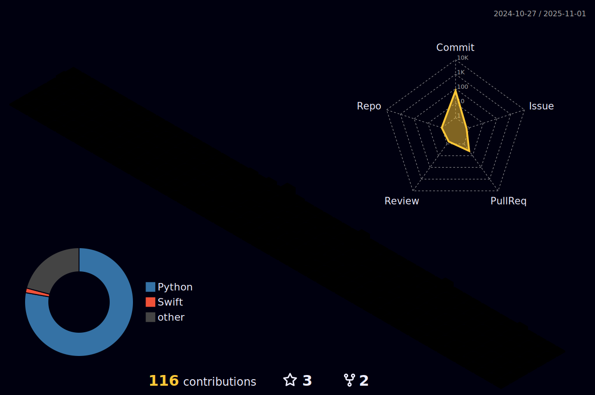

 

  
<table width="100%" style="border-collapse: collapse;">
 <tr>
  <td width="45%" valign="top">
    <h2>Tecnologias e linguagens 💻</h2>
    
    <h3>🚀 Frameworks e bibliotecas</h3>
    
    <h3>🛠️ Ferramentas de desenvolvimento</h3>
    
  </td>
  <td width="55%" valign="middle" align="center">
    
      
    
  </td>
 </tr>
</table>
  
  ##
  
  
 

  
   
    
    
    
     
 

 <picture>
  <source media="(prefers-color-scheme: dark)" srcset="https://raw.githubusercontent.com/jhoneshark/jhoneshark/output/pacman-contribution-graph-dark.svg">
  <source media="(prefers-color-scheme: light)" srcset="https://raw.githubusercontent.com/jhoneshark/jhoneshark/output/pacman-contribution-graph.svg">
  
</picture>
  

  
  
  
  
